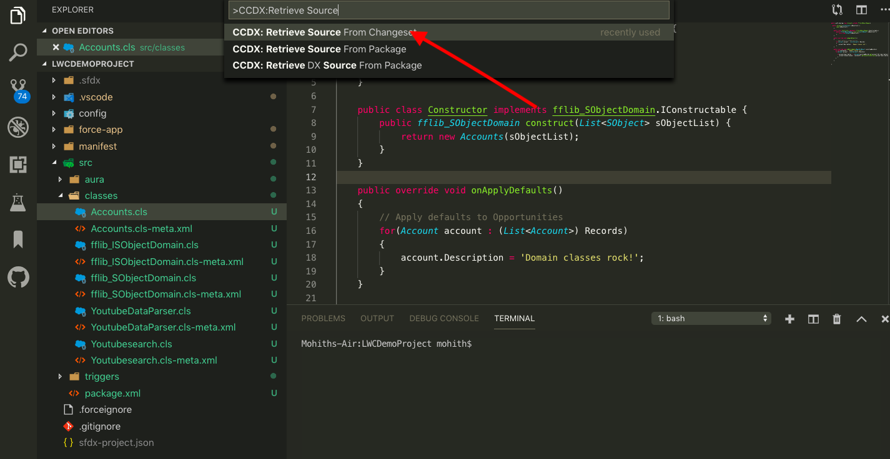
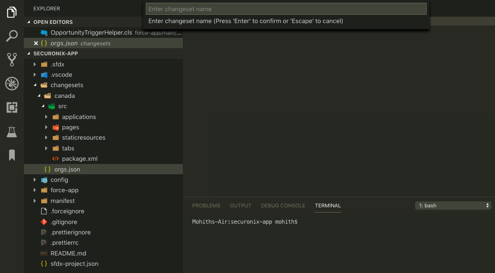
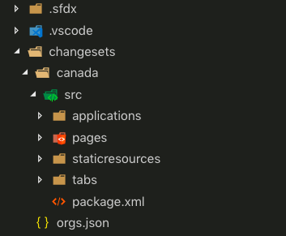
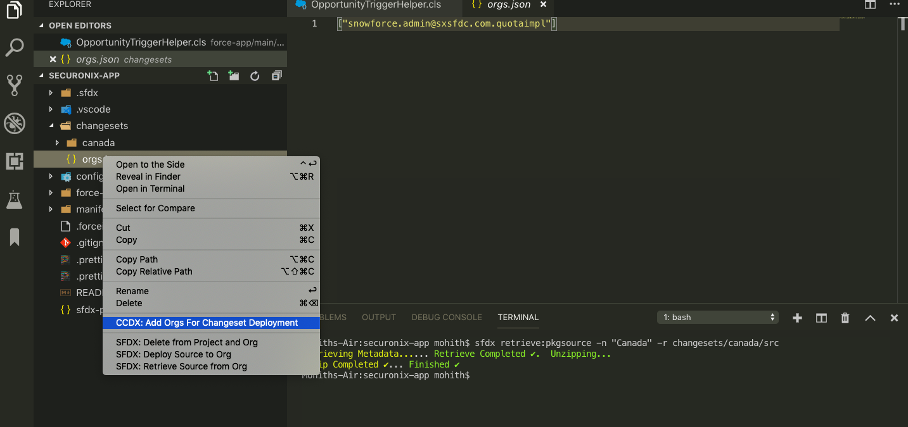
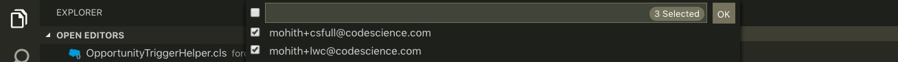
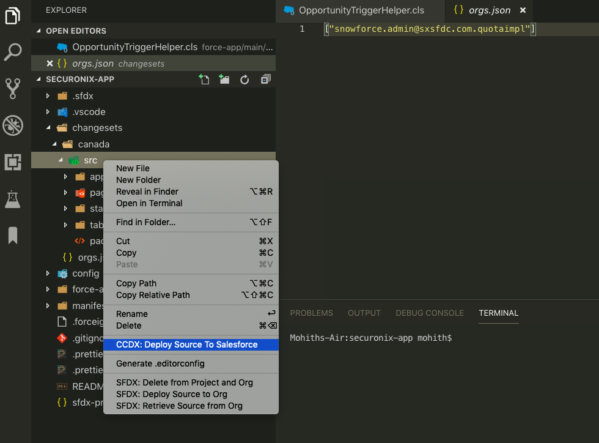
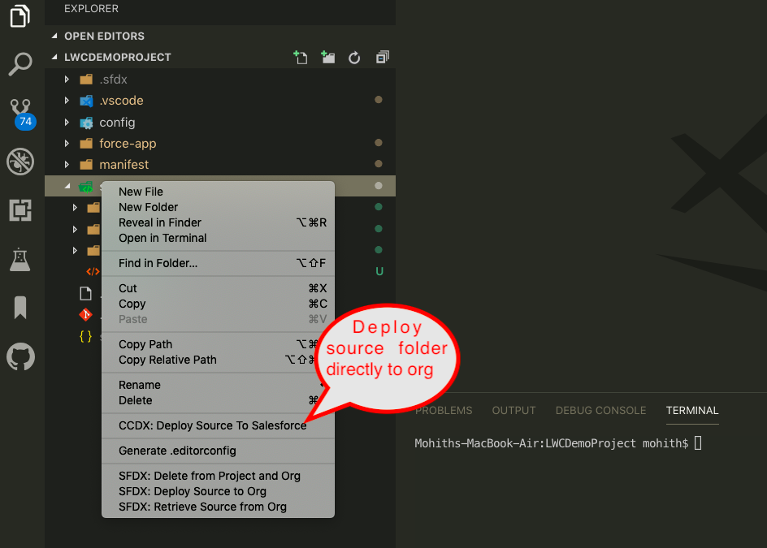

# Change Log
All notable changes to the "dx-code-companion" extension will be documented in this file.

### 0.3.6
1.To manage settings you dont need to edit the settings.json and instead has UI
2.Security path via npm audit

### 0.3.3

1.Update the sfdx-core to use latest version.
2.Save to salesforce would automatically kick off  when vscode opens a folder. Made sure it happens only when user manually tries to save the file
3.Remove support for v1.29.0 vscode. Requires v1.30.0 and above

### 0.3.0

Fully support changeset driven development (https://trailhead.salesforce.com/en/content/learn/modules/declarative-change-set-development/develop-and-test-changes-locally)

This version requires you to upgrade mo-dx-plugin to 0.2.0 version.

Run `sfdx plugins:update` to update mo-dx-plugin to latest

With this release,you can use DX Code Companion extension to retrieve source from the changeset created in your sandbox (Assumes you have authorized CLI to sandbox using "SFDX:Authorize and org").Use vscode to edit contents if needed and then deploy to target orgs all from VScode without need to upload the changesets and wait.

  1) To retrieve source from the changeset use the command pallete and select "CCDX:Retrieve Source From Changeset"

  

  2) Provide the changeset name in the text box (Avoid creating changesets with same name in sandbox)

  

  3) Once code components are retrieved , Under changeset directory a sub directory will be created with src folder having all the components .You can edit the source code and also save to the authenticated orgs.

  

  4) Note that the changeset directory has orgs.json to which you can add list of orgs you have authorized salesforce CLI by clicking on the file and using "CCDX:Add Orgs For Changeset Deployment"

  

   

  5.Click on "src" folder for your changeset to deploy them . The interface will ask you to pick org from the list of orgs you have added in previous step

  

### 0.2.8

1. Fixes connection method to use salesforce core library native methods
2. Adds ability to deploy the src folder for classic metadata directly from explorer menu. Note this expects you have source in classic metadata format

### 0.2.7

1. Fixes Manage Conflicts with server is not working for Apex Components and Apex Pages

### 0.2.6

1. Fix issue by changing the folder name of content provider to use Capital letter. Seems very weird that not doing this breaks the plugin for chrome-os. The issue is described here (https://github.com/msrivastav13/DX-Code-Companion/issues/6)

### 0.2.5

1. Adds a new Command Compare With Server to view diff between current local and server file.

2. By default Manage Conflict is switched off .Turn it on via settings 

3. Fixed few bugs related to refresh from server on aura components.

### 0.2.4

1. Fixes when .xml files would try to save to server .This is not supported at this point and use native salesforce extension to deploy meta.xml files for version changes .

### 0.2.0

1. Adds ability to manage conflicts with server copy

2. Refresh From Server for LWC, Aura files , triggers , vf pages, vf components and classes

3. Save now compares file with server copy .

4. A new icon on the footer to indicate SalesforceDX Code Companion is active

5. Footer now indicates a rocket symbol if extension is active and you can navigate to org clicking on this .

### 0.1.10

1. Auto populate package list for selection for Retrieve Options

2. Retrieve DX Source and metadata options are only available from Command Palette (CMD+ SHIFT + P on MACOSX or CTRL + SHIFT + P on windows)

3. Previously the Save To Server tried running command on Non Salesforce files .This update fixes this and only saves if the working directory root has sfdx-project.json file.

### 0.1.8

1.Switch between authenticated orgs using new Switch Org Command .This opens up to switch and deploy the code between orgs using SFDX:Deploy To Org Command

2.Fix AutoSave to now not run terminal command if file type is not supported

3.Better naming and Grouping .All Commands now CCDX as the prefix .

4.LWC(Lighnting Web Components) support improved

5.Introduces sfdx-core library in the build opening up lot more existing features to come in next release.

### 0.1.4

1.Auto Save enabled .You can disable using the autosave property

Use the settings (Select Code > Preferences > Settings) from the gear icon and modify the usersettings to disable the autosave feature as shown below by setting dx-code-companion.autosave.enabled as false .

2.Save LWC Components(Under preview).Upgrade the mo-dx-plugin using sfdx:plugins:update mo-dx-plugin

### 0.1.3

1.Add support to retrieve metadata using package name in regular metadata format

2.Add some useful link in editor title for vf preview , app builder page ,metadata coverage report and component Library.

### 0.0.5

1. Fixes issues for keyboard shortcut

### 0.0.2

1. Provides quick save apex,vf,aura bundles to salesforce server
2. Retrieve Source from Salesforce using DX Source format.
3. 3X performant than salesforce deploy command for apex,aura and vf files.