# SalesforceDX Code Companion 

**Note that this is not official from Salesforce. I created this extension to help my own development workflow for building salesforce apps. This extension supplements Salesforce Official Extension Pack with features like faster save of apex,lwc and vf pages.You can use this to also retrieve package metadata from salesforce orgs in both traditional metadata and SalesforceDX formats. Also supports managing conflicts between salesforce files and salesforce org**

Provides ability to save Apex Classes,Apex Triggers, Visualforce, AuraBundles, Lightning Web Component Bundles(under preview) and ApexComponents to Salesforce Org at blazing speed without source tracking. Also enables retrieving code from the salesforce unmanaged package/changesets in both DX and NonDX source formats .You can also switch between authenticated orgs easily with CCDX: Switch Command. This extension requires users to have SalesforceDX CLI and also mo-dx-plugin(run **sfdx plugins:install mo-dx-plugin**) for SalesforceDX CLI.This Extension works with both scratch orgs and Non-scratch orgs.

It is highly recommended to use with Salesforce Extension Pack to get all the other good things salesforce official extension offers (https://marketplace.visualstudio.com/items?itemName=salesforce.salesforcedx-vscode) .

# Requirements

This vscode extension works only once you have installed Salesforce CLI and a mo-dx-plugin(run **sfdx plugins:install mo-dx-plugin** on your terminal) that has api for all the commands this extension leverages .

1. Install SalesforceDX CLI from https://developer.salesforce.com/tools/sfdxcli based on your operating system.
2. Install mo-dx-plugin using the command `sfdx plugins:install mo-dx-plugin`.Note if you have already then make sure to update to latest always using `sfdx plugins:update`
3. VScode version 1.29 and beyond
4. Salesforce official plugin provides great syntax and language support.Highly recommend to install (https://marketplace.visualstudio.com/items?itemName=salesforce.salesforcedx-vscode)
5. You have project workspace set up and have sfdx-project.json file in the root folder and you have ran sfdx force:auth:web:login for project folder and authorized your org with Salesforce CLI. 
6. Extension activation is shown in footer with a rocket symbol. Once extension is active authorize the project if you havent and enjoy faster deploys

# Features

1. **Retrieve Source in DX Source format from Managed/Unmamaged package/ChangeSets**

    From the command palette menu select "Retrieve DX Source From Package" . Provide the name of the managed/unmanaged package in input box and press enter .This is the recommended source format.

    The source is in the format specified here (https://developer.salesforce.com/docs/atlas.en-us.sfdx_dev.meta/sfdx_dev/sfdx_dev_source_file_format.htm)

    You will notice that package.xml is autogenerated in the manifest directory and source code of the package is retrieved in DX source format in force-app folder. 

    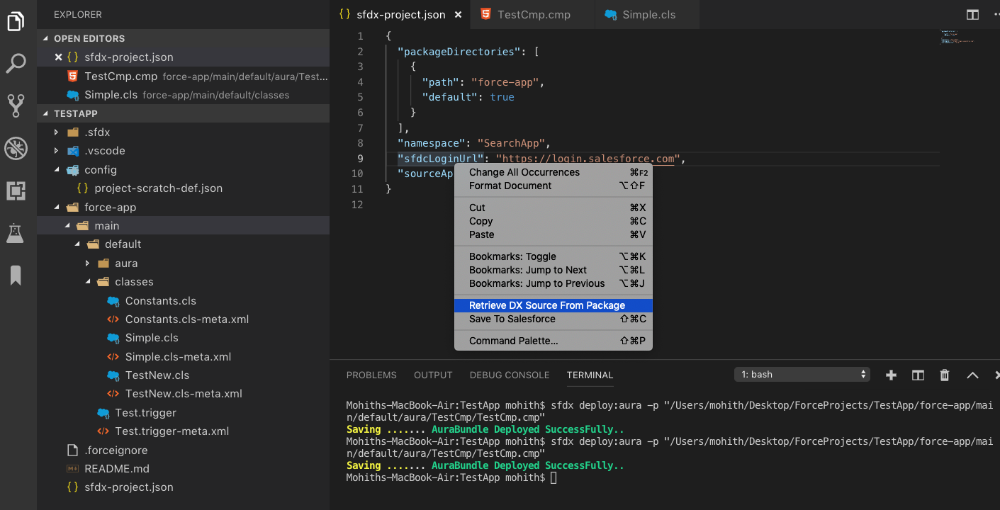

2. **Retrieve Source from Managed/Unmamaged package/Changesets in traditional metadata format**

    From the command palette menu select "Retrieve Source From Package". Provide the name of the managed/unmanaged package and press enter .Projects still not moved to the DX format can benefit from this .

    You will notice that package.xml is autogenerated  and source code of the package is retrieved in src folder. Create a folder src if your project does not have one.

    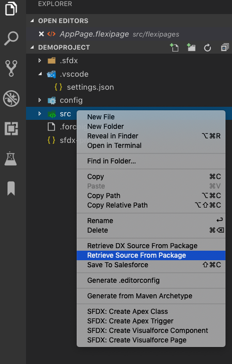

3. **Save Apex Class,Apex Trigger,Visualforce Page and Visualforce Component To Salesforce Org**

    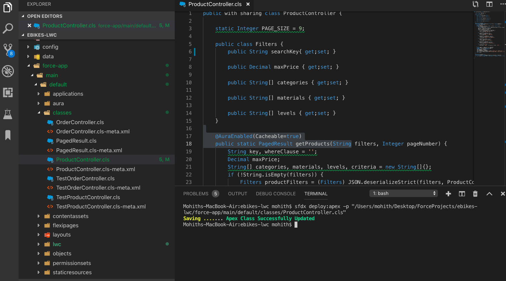

    By default autosave is enabled .Hence when you save file the extension will try to save the file to salesforce you have logged in by default.

    If you disable auto save feature you can also Right click on the File and click "Save To Salesforce Menu"

4. **Save Lightning Components (Both aura and LWC) To Salesforce Org**

    If you disable auto save feature you can also Right click on the File and click **_"Save To Salesforce"_**

    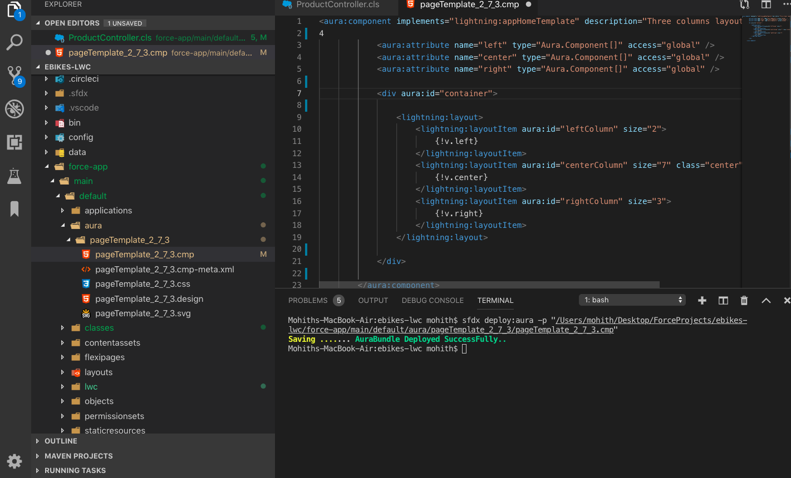

    Save LWC (Available in Spring 19 pre-release orgs)

    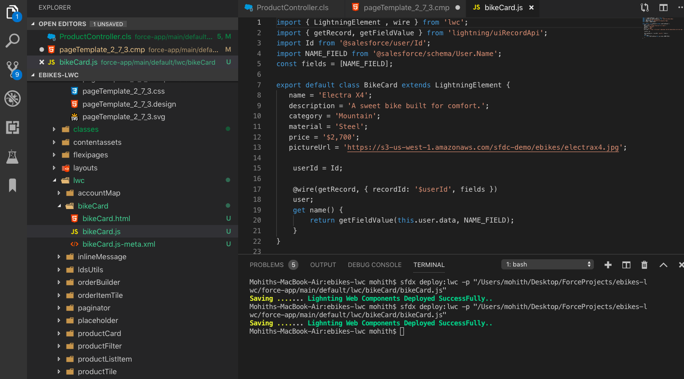

5. **Manage Conflicts with server**

    This feature is turned on by default .It compares server copy with the local copy before save and if a difference is found you will see a prompt in a diff editor with options to either overwrite or accept change from server .Also you can manually resolve the conflicts and push changes .

    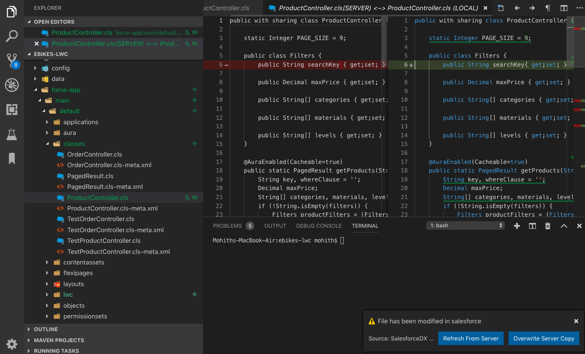

    If you wish to turn this feature (If you have VCS for your project and do not develop in team) for faster save you can do so by disabling Manageconflict settings found in  settings for extension

    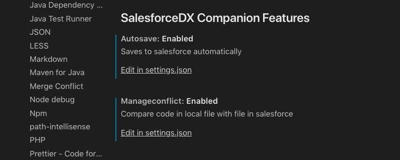

6. **Smart Navigations to VF page preview ,Lighnting App Builder Page ,Salesforce Lightning Design System Website ,Salesforce MetadataCoverage Report and Component Library URL**

    Screenshot shows how one can find these smart navigation

    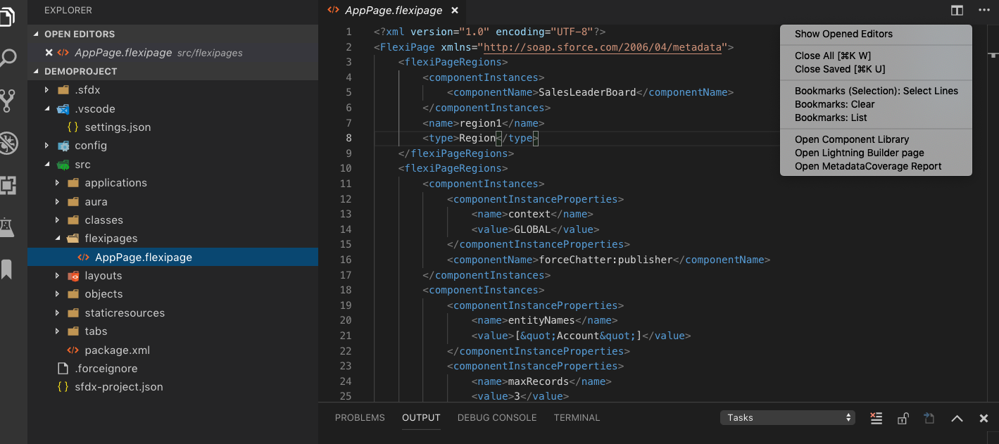

    ## Display Status of Save and Success

    1. When Saving files to Salesforce Status of Success or Failure is always displayed on the Terminal .
    2. Extension relies on Terminal API and hence to see any errors and progress keep the Terminal On.

    Below screenshot shows how the errors are logged

    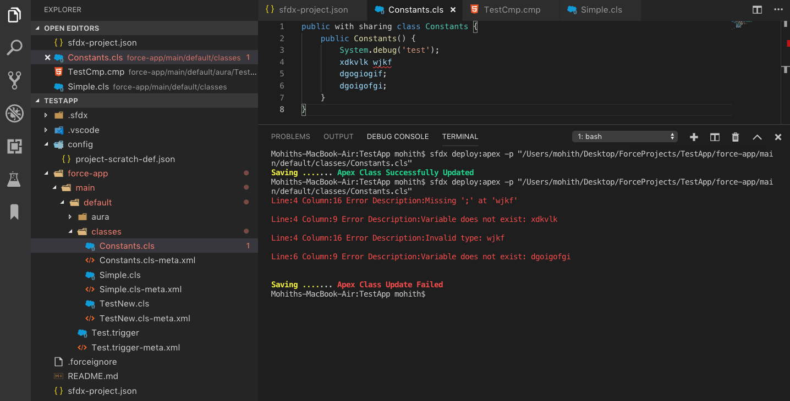

# Video Recordings of all features 

https://www.youtube.com/playlist?list=PLDFd1LjbN883y5IlMuU8BCyGhRO-VMuw9

# Issue Reporting

You can join the slack channel for any assistance [here](https://join.slack.com/t/salesforcedxc-ej87847/shared_invite/enQtNTQ4MjM2MTEzNjg2LTg2NzA4YTQ5ZTRkYzZjYTI4MDFhODQ2MDQ1ZjNmNzVmMTg5M2E0NTI2NzE0YWVmZjRjMGIwNmQ5YjkyMWEzZWU). 

If you find any issues feel free to log it on the github page for the project @ https://github.com/msrivastav13/DX-Code-Companion/issues

You can also reach out to me via my twitter @msrivastav13 or via my MVP email handle mohith.shrivastava@salesforcemvps.com

## Extension Shortcut Keys

To open command pallete and look for all CCDX Commands use below .

"MACOSX": "cmd+shift+p",
"win": "ctrl+shift+p",
"linux": "ctrl+shift+p",

# Release Notes

### 0.2.4

1. Fixes when .xml files would try to save to server .This is not supported at this point and use native salesforce extension to deploy meta.xml files for version changes .

### 0.2.0

1. Adds ability to manage conflicts with server copy

2. Refresh From Server for LWC, Aura files , triggers , vf pages, vf components and classes

3. Save now compares file with server copy .

4. A new icon on the footer to indicate SalesforceDX Code Companion is active

5. Footer now indicates a rocket symbol if extension is active and you can navigate to org clicking on this .

### 0.1.10

1. Auto populate package list for selection for Retrieve Options

2. Retrieve DX Source and metadata options are only available from Command Palette (CMD+ SHIFT + P on MACOSX or CTRL + SHIFT + P on windows)

3. Previously the Save To Server tried running command on Non Salesforce files .This update fixes this and only saves if the working directory root has sfdx-project.json file.

### 0.1.8

1.Switch between authenticated orgs using new Switch Org Command .This opens up to switch and deploy the code between orgs using SFDX:Deploy To Org Command

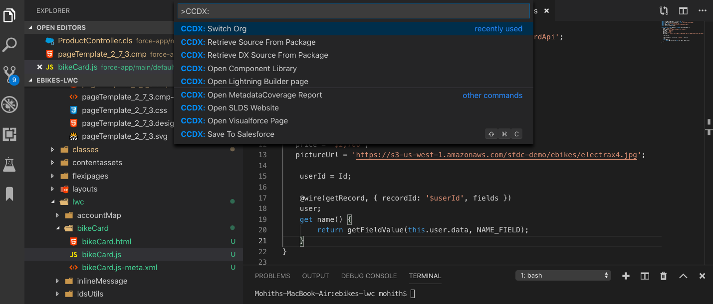

2.Fix AutoSave to now not run terminal command if file type is not supported

3.Better naming and Grouping .All Commands now CCDX as the prefix .

4.LWC(Lighnting Web Components) support improved

5.Introduces sfdx-core library in the build opening up lot more existing features to come in next release.

### 0.1.4

1.Auto Save enabled .You can disable using the autosave property

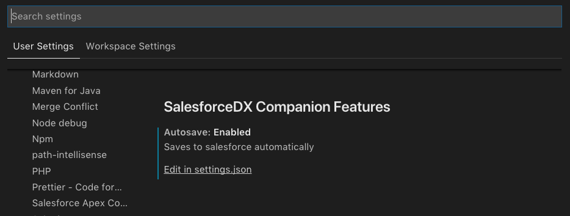

Use the settings (Select Code > Preferences > Settings) from the gear icon and modify the usersettings to disable the autosave feature as shown below by setting dx-code-companion.autosave.enabled as false .

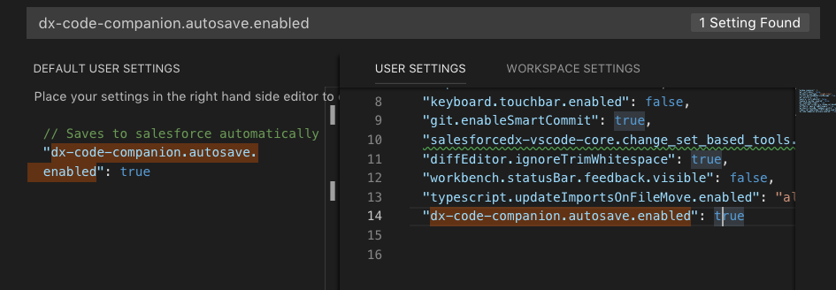

2.Save LWC Components(Under preview).Upgrade the mo-dx-plugin using sfdx:plugins:update mo-dx-plugin

### 0.1.3

1.Add support to retrieve metadata using package name in regular metadata format

2.Add some useful link in editor title for vf preview , app builder page ,metadata coverage report and component Library.

### 0.0.5

1. Fixes issues for keyboard shortcut

### 0.0.2

1. Provides quick save apex,vf,aura bundles to salesforce server
2. Retrieve Source from Salesforce using DX Source format.
3. 3X performant than salesforce deploy command for apex,aura and vf files.

-----------------------------------------------------------------------------------------------------------

### For more information and contribution to project visit the below repositories and use issues tab to log any feedback or issues .

* [Mo DX Plugin Repository](https://github.com/msrivastav13/mo-dx-plugin)
* [DX Code Companion](https://github.com/msrivastav13/DX-Code-Companion)

**Enjoy!**
