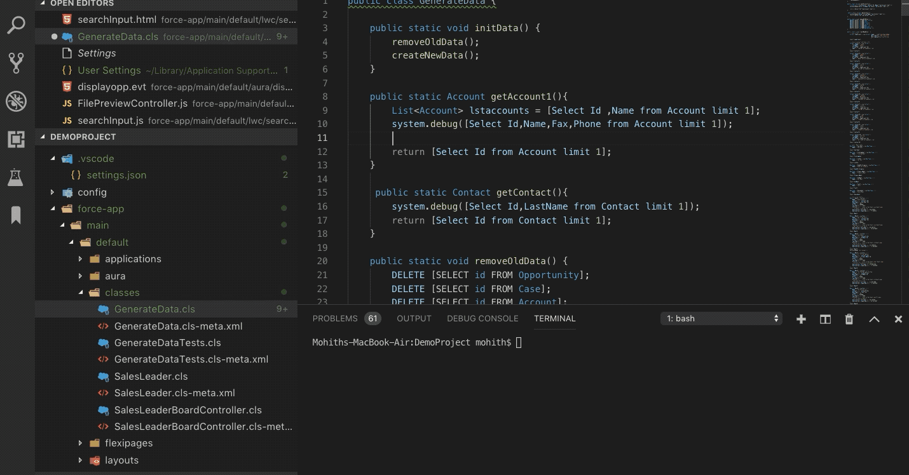
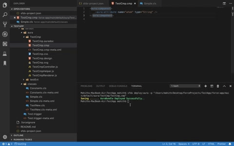

# SalesforceDX Code Companion

Provides ability to save Apex Classes, Apex Triggers, Visualforce, AuraBundles and ApexComponents to Salesforce org at blazing speed.This extension requires users to have SalesforceDX CLI and also mo-dx-plugin for SalesforceDX CLI.This Extension works with both scratch orgs and Non-scratch orgs.

It is highly recommended to use with Salesforce Extension Pack (https://marketplace.visualstudio.com/items?itemName=salesforce.salesforcedx-vscode) .

## Requirements

This salesforce extension works only once you have installed Salesforce CLI and a custom plugin that has api for all the commands this plugin leverages .

1. Install SalesforceDX CLI from https://developer.salesforce.com/tools/sfdxcli based on your operating system.
2. Install mo-dx-plugin using the command `sfdx plugins:install mo-dx-plugin`
3. Salesforce official plugin provides great syntax and language support .Highly recommend to install (https://marketplace.visualstudio.com/items?itemName=salesforce.salesforcedx-vscode)
4. When you open the VScode , it is recommended to wait for few seconds for Salesforce CLI or Salesforce VScode plugin to authorize the connection .This plugin depends on CLI to do auth and uses the session from the CLI.

## Features

1. **Save Apex Class,Apex Trigger,Visualforce Page and Visualforce Component To Salesforce Org**

Right click on the File and click **_"Save To Salesforce"_**

2. **Save Lightning Components To Salesforce Org**

Right click on the File and click **_"Save To Salesforce"_**

3. **Retrieve Source In DX format from Managed/Unmamaged Package**

Right click and click **_"Retrieve DX Source From Package"_**. Provide the name of the managed/unmanaged package and press enter .

You will notice that package.xml is autogenerated in the manifest directory and source code of the package is retrieved in DX source format. 

4. **Retrieve Source from Managed/Unmamaged Package In Regular metadata format**

Right click and click **_"Retrieve Source From Package"_**. Provide the name of the managed/unmanaged package and press enter .

You will notice that package.xml is autogenerated  and source code of the package is retrieved in src folder. Create a folder src if your project does not have one.

5. **Smart Navigations to VF page preview , Lighnting App Builder Page , Salesforce MetadataCoverage Report and Component Library URL**

Screenshot shows how one can find these smart navigation

## Display Status of Save and Success

1. When Saving files to Salesforce Status of Success or Failure is always displayed on the Terminal .
2. Extension relies on Terminal API and hence to see any errors and progress keep the Terminal On .

Below screenshot shows how the errors are logged

## Extension Shortcut Keys

To Save any of the supported files to salesforce you can use the below shorcut keys based on the operating system.

"MACOSX": "cmd+shift+c",
"win": "ctrl+shift+c",
"linux": "ctrl+shift+c",

## Issue Reporting

If you find any issues feel free to log it on the github page for the project @ https://github.com/msrivastav13/DX-Code-Companion/issues

## Release Notes

### 0.1.3

1.Add support to retrieve metadata using package name in regular metadata format

2.Add some useful link in editor title for vf preview , app builder page ,metadata coverage report and component Library.

### 0.0.4

1. Fixes issues for keyboard shortcut

### 0.0.2

1. Provides quick save apex,vf,aura bundles to salesforce server
2. Retrieve Source from Salesforce using DX Source format.
3. 3X performant than salesforce deploy command for apex , aura and vf files.

-----------------------------------------------------------------------------------------------------------

### For more information and contribution to project visit the below repositories and use issues tab to log any feedback or issues .

* [Mo DX Plugin Repository](https://github.com/msrivastav13/mo-dx-plugin)
* [DX Code Companion](https://github.com/msrivastav13/DX-Code-Companion)

**Enjoy!**
